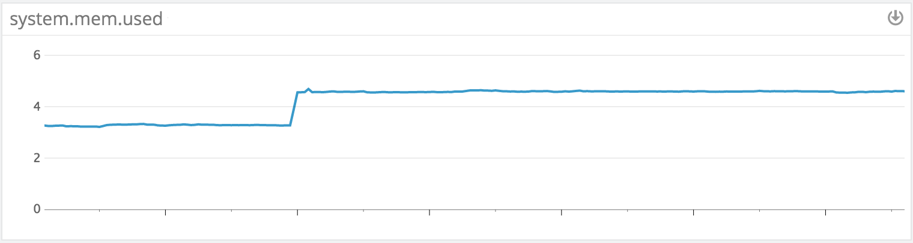
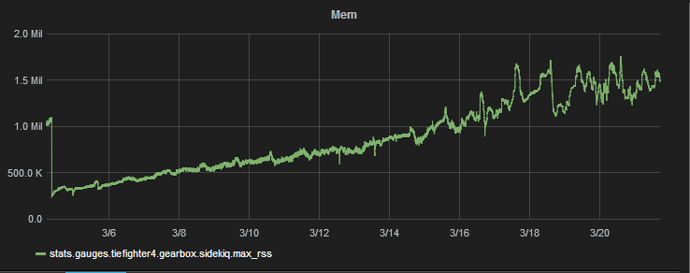
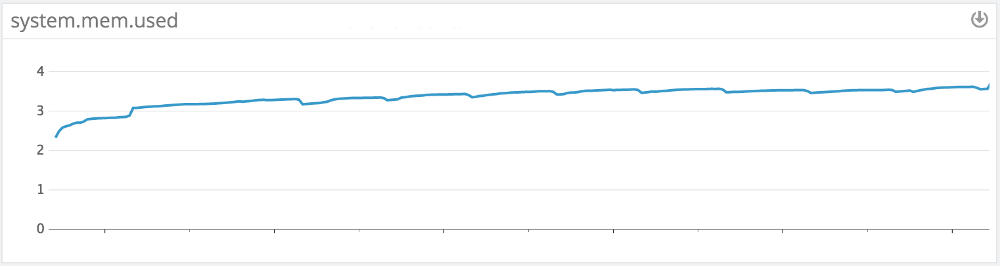

# Ruby Memory Issues and Where to Find Them 

## Memory Bloat

When code tries to allocate a lot of objects simultaneously.

**Where to find**: process big json or XML file in none streaming manner, or load a big number of objects from the database without batching.

**Symptoms**: "stepwise jumps" in memory.

---

## Ruby Leak

When reference to object lives longer than expected.

**Where to find**: caching, memoization, i18n.

**Examples**:
- http://blog.skylight.io/hunting-for-leaks-in-ruby/
- https://github.com/discourse/discourse/commit/830ce05fe64fd310d26d7da87ea6e4076696b7c8

**Symptoms**: linear grows in memory.

Image credit: [samsaffron](https://samsaffron.com/archive/2015/03/31/debugging-memory-leaks-in-ruby).

## C Leak

When the leak happens in C-land.

**Examples**:
- http://www.be9.io/2015/09/21/memory-leak/
- https://github.com/ASoftCo/leaky-gems

---

## Object Grinder

This is not commonly recognized as a memory issue, but it is one. Happens when code uses a lot of temporary objects, which leads to increased pressure on GC and to memory fragmentation.

**Where to find**: everywhere.

**Examples**:
- default arguments https://github.com/JuanitoFatas/fast-ruby/pull/137
- string literals without freeze (`# frozen_string_literal: true`)

**Symptoms**: logarithm-like memory growth.

---

## Memory Hog

Not commonly recognized as a memory issue, but it is one. Happens when code loads big sets of data and never unloads them.

**Where to find**: data gems.

**Examples**:
- https://github.com/mime-types/ruby-mime-types/issues/123
- https://github.com/RubyMoney/money/pull/691
- https://github.com/rack/rack-contrib/pull/131
- https://github.com/svenfuchs/i18n/pull/391
